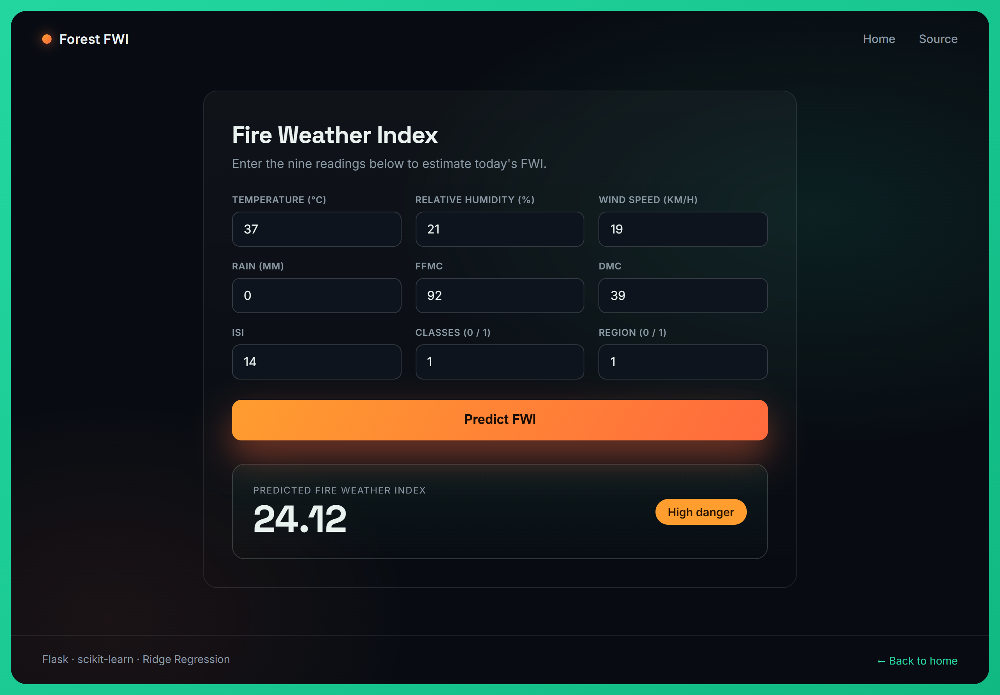
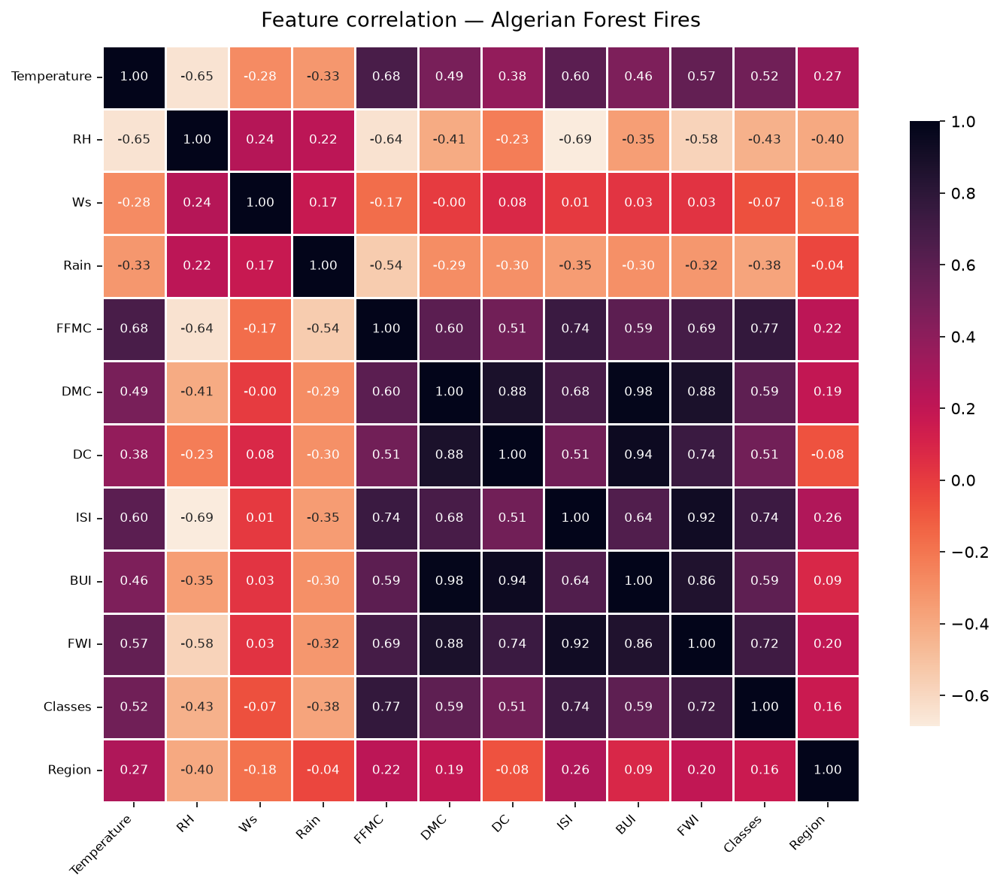
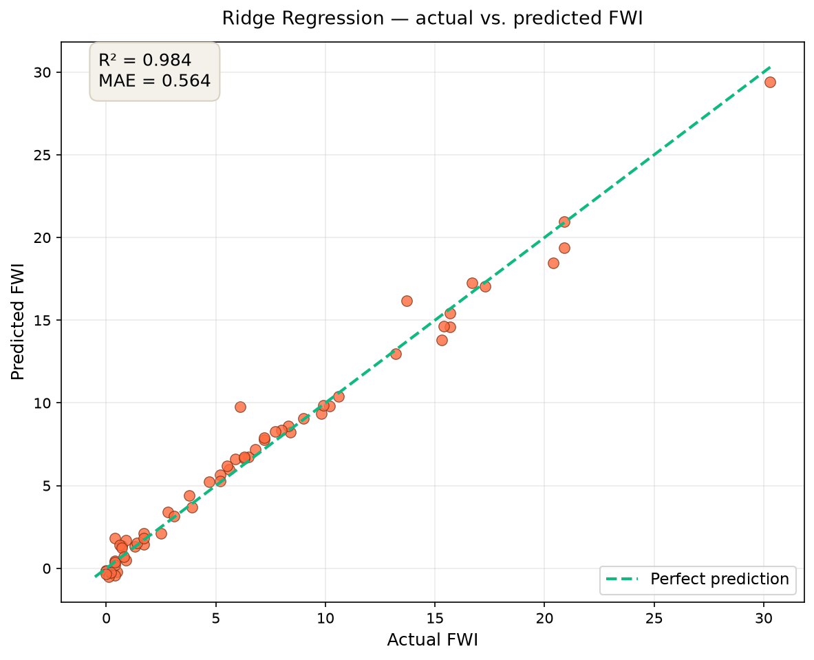

# Algerian Forest Fire — FWI Prediction

A web app that predicts the **Fire Weather Index (FWI)** from weather and fuel-moisture readings using a Ridge Regression model. Built with Flask and scikit-learn, with a custom front end.

The model is trained on the [Algerian Forest Fires dataset](https://archive.ics.uci.edu/dataset/547/algerian+forest+fires+dataset) from the UCI Machine Learning Repository, which covers the Bejaia and Sidi-Bel Abbes regions of Algeria between June and September 2012.

## Screenshots

**Landing page**


**Prediction page**



## How the app works

The user enters nine values (temperature, humidity, wind, rain, and four fire-behaviour indices). The app scales them with the same `StandardScaler` that was fitted during training, feeds them to the trained Ridge model, and returns the predicted FWI together with a danger band:

| FWI | Danger band |
|---|---|
| below 5 | Low |
| 5 – 15 | Moderate |
| 15 – 25 | High |
| 25 and above | Extreme |

## How the model works

The full pipeline lives in `notebooks/project.ipynb`. In summary:

1. **Cleaning** — the raw file stacks the two regions on top of each other, so a `Region` column is added (0 = Bejaia, 1 = Sidi-Bel Abbes), missing rows and a repeated header row are dropped, column names are trimmed, and every column is cast to its correct numeric type.
2. **Encoding** — the target class label is converted to a number (`not fire` = 0, `fire` = 1).
3. **Feature selection** — a correlation matrix is used to drop features that are more than 0.85 correlated with another feature. `BUI` and `DC` are removed because they carry almost the same information as `DMC` and the other indices (see the heatmap below), which leaves the nine features the app asks for.
4. **Scaling** — features are standardised with `StandardScaler` (mean 0, variance 1) so no single feature dominates.
5. **Training** — the data is split 75% train / 25% test, and five linear models are compared. Ridge Regression is chosen for deployment.

### Feature correlation



`FWI` is most strongly correlated with `ISI` (0.92), `DMC` (0.88) and `BUI` (0.86). Because `BUI` (0.98 with `DMC`) and `DC` (0.94 with `BUI`) are near-duplicates of features already in the model, they are dropped to avoid multicollinearity.

## Model performance

All five models were evaluated on the 25% hold-out test set. Scores are R² (higher is better, 1.0 is perfect) and Mean Absolute Error (lower is better).

| Model | R² | MAE |
|---|---|---|
| Linear Regression | 0.985 | 0.547 |
| **Ridge (deployed)** | **0.984** | **0.564** |
| LassoCV | 0.981 | 0.636 |
| Lasso | 0.949 | 1.133 |
| ElasticNet | 0.875 | 1.882 |

Plain Linear Regression scores marginally highest, but Ridge is deployed because its L2 regularisation makes it more robust to multicollinearity and small changes in the data, at essentially no cost in accuracy (R² 0.984 vs 0.985). Lasso and ElasticNet trade too much accuracy away at their default regularisation strength.

### Ridge — actual vs. predicted



Each point is a test-set sample; the dashed line is a perfect prediction. The points sit close to the line, which is what the R² of 0.984 and a mean absolute error of about 0.56 FWI points describe.

## Project structure

```
.
├── application.py          Flask app: routes and prediction logic
├── requirements.txt        Python dependencies
├── Procfile                Start command for deployment (gunicorn)
├── models/
│   ├── ridge.pkl           Trained Ridge Regression model
│   └── scaler.pkl          StandardScaler fitted on the training data
├── static/css/style.css    Front-end styling
├── templates/
│   ├── index.html          Landing page
│   └── home.html           Prediction form and result
├── screenshots/            Images used in this README
└── notebooks/
    ├── project.ipynb       Full workflow: cleaning, EDA, training, export
    └── *.csv               Raw and cleaned datasets
```

## Getting started

Clone the repository:

```bash
git clone https://github.com/Hanzala-Nadeem/algerian-forest-fire-fwi-prediction-using-ridge_regression.git
cd algerian-forest-fire-fwi-prediction-using-ridge_regression
```

Create a virtual environment and install the dependencies:

```bash
python -m venv venv
venv\Scripts\activate
pip install -r requirements.txt
```

Run the app:

```bash
python application.py
```

Then open http://localhost:5000 in your browser. For a production server, use `gunicorn application:app`.

## Model inputs

| Feature | Description | Example |
|---|---|---|
| Temperature | Temperature at noon (°C) | 29 |
| RH | Relative humidity (%) | 57 |
| Ws | Wind speed (km/h) | 18 |
| Rain | Total rain (mm) | 0.0 |
| FFMC | Fine Fuel Moisture Code | 65.7 |
| DMC | Duff Moisture Code | 3.4 |
| ISI | Initial Spread Index | 1.3 |
| Classes | Fire class (0 = not fire, 1 = fire) | 0 |
| Region | 0 = Bejaia, 1 = Sidi-Bel Abbes | 0 |

## Tech stack

Python · Flask · scikit-learn · pandas · numpy · matplotlib · seaborn

The bundled model files were produced with scikit-learn 1.7.2. To regenerate them with your own version, re-run `notebooks/project.ipynb`.
